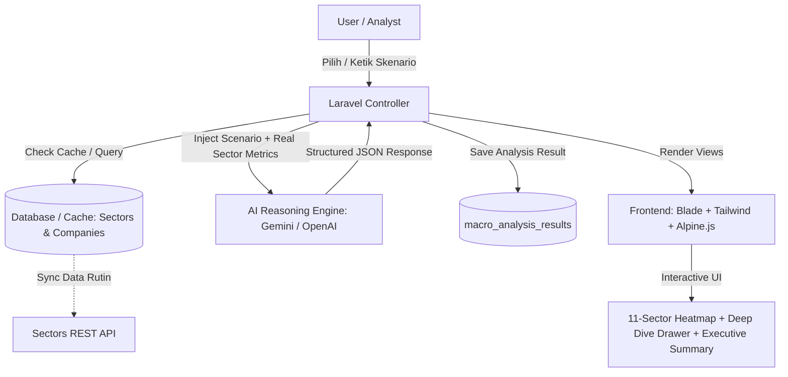

# PRODUCT REQUIREMENT DOCUMENT (PRD)

**Project Name:** MacroSectors AI  
**Document Version:** 1.0 (Refined & Production-Ready)  
**Author:** Wesley Wilnio  
**Target Competition:** Sectors Hackathon Indonesia 2026  
**Track:** Track 3 – Market Intelligence *(Fallback: Track 1 – AI Agents & Assistants)*  
**Date:** 7 September 2026  
**Status:** Ready for Review  

---

## 1. EXECUTIVE SUMMARY

### 1.1 Problem Statement
Perubahan kondisi ekonomi makro global—seperti penyesuaian suku bunga acuan bank sentral (The Fed / BI), fluktuasi nilai tukar Rupiah terhadap USD, guncangan rantai pasok global, dan lonjakan harga komoditas energi/pangan—memiliki dampak berantai yang asimetris terhadap 11 sektor di Bursa Efek Indonesia (BEI/IHSG).

Saat ini terdapat jurang pemisah (*information gap*):
* **Fragmentasi Data:** Data fundamental emiten lokal dari bursa terisolasi dari analisis sentimen makro ekonomi makro global.
* **Proses Analisis Lambat & Manual:** Analis ekuitas dan investor ritel harus menghitung rasio paparan risiko (misal: rasio beban utang valas, ketergantungan bahan baku impor vs pendapatan ekspor) secara manual di spreadsheet.
* **Kurangnya Simulasi Skenario (Stress-Testing):** Sulit memetakan secara instan sektor mana yang tangguh (*resilient*) atau rentan (*vulnerable*) ketika suatu guncangan ekonomi terjadi.

### 1.2 Solution Overview
**MacroSectors AI** adalah platform *macro-to-micro intelligence engine* berbasis web yang menerjemahkan skenario disrupsi ekonomi global langsung ke analisis fundamental sektor dan emiten di Indonesia. 

Platform ini menggabungkan:
1. **Sectors REST API** sebagai sumber kebenaran (*single source of truth*) data fundamental, klasifikasi 11 sektor IHSG, dan metrik keuangan emiten.
2. **LLM Reasoning Engine (Gemini / OpenAI)** untuk melakukan sintesis skenario dan memetakan transmisi dampak ekonomi.
3. **Interactive Sector Heatmap & Resilience Scoring (-10 s.d +10)** untuk visualisasi cepat sektor yang diuntungkan atau dirugikan.
4. **Company Deep Dive Table** yang menyoroti emiten paling terekspos risiko atau memiliki daya tahan tertinggi berdasarkan data fundamental riil.

### 1.3 One-Sentence Pitch
> *"A macro-to-micro intelligence engine that translates global economic shifts into actionable sector resilience scores for Indonesian capital markets using Sectors API and AI."*

---

## 2. USER PERSONAS & TARGET AUDIENCE

### 2.1 Primary Persona: Business & Equity Analyst
* **Peran:** Research Analyst di sekuritas atau konsultan bisnis independen.
* **Kebutuhan:** Memetakan sensitivitas sektor domestik terhadap dinamika ekonomi internasional untuk penyusunan laporan harian/mingguan secara cepat.
* **Pain Point:** Menghabiskan waktu berjam-jam mengumpulkan data rasio DER (utang), NPM (marjin laba), dan eksposur valas tiap emiten secara manual saat ada berita makro mendadak.
* **Ekspektasi Solusi:** Input satu skenario makro, dapatkan ringkasan eksekutif berbasis data beserta emiten kunci dalam hitungan detik.

### 2.2 Secondary Persona: Sophisticated Retail Investor & Corporate Finance
* **Peran:** Investor saham mandiri atau manajer keuangan perusahaan.
* **Kebutuhan:** Melindungi portofolio dari risiko sistemik makro dan mencari peluang rotasi sektor (*sector rotation*).
* **Pain Point:** Sering terjebak *noise* berita dan sulit memvalidasi apakah suatu sentimen benar-benar berdampak pada fundamental sektor tertentu.
* **Ekspektasi Solusi:** Indikator visual intuitif (*Heatmap*, status Resilient vs Vulnerable) yang disertai argumentasi fundamental yang rasional dan transparan.

---

## 3. CORE PRODUCT REQUIREMENTS & FEATURES

### 3.1 Feature Matrix (MVP Scope)

| Feature Code | Feature Name | Description | Priority |
| :--- | :--- | :--- | :--- |
| **FR-01** | **Macro Scenario Engine** | Input skenario makro melalui dua opsi: **Preset Skenario Cepat** (misal: *The Fed Kerek Suku Bunga +50 bps*, *Rupiah Melemah ke Rp16.800/USD*, *Harga Minyak Dunia Melonjak*) atau **Custom Scenario Input** (teks bebas skenario pengguna). | **P0 (Must Have)** |
| **FR-02** | **Sector Resilience Heatmap** | Visualisasi grid interaktif 11 sektor IHSG dengan skala warna dinamis berdasarkan **Impact Score (-10 hingga +10)**: Hijau (Resilient/Beneficiary), Abu-abu (Neutral), Merah (Vulnerable/Critical). | **P0 (Must Have)** |
| **FR-03** | **AI Executive Brief & Reasoning** | Analisis naratif terstruktur dalam Bahasa Indonesia dari LLM: transmisi makro-ke-mikro, alasan rasional di balik skor sektor, serta katalis positif & risiko utama. | **P0 (Must Have)** |
| **FR-04** | **Company Exposure Deep Dive** | Tabel emiten teratas dalam sektor terpilih yang menampilkan indikator fundamental kunci dari Sectors API: *Market Cap, DER, NPM, PBV, PE, dan indikator beban/keuntungan*. | **P0 (Must Have)** |
| **FR-05** | **Data Grounding & Caching System** | Mekanisme *caching* data Sectors API lokal agar analisis AI grounded pada fakta data riil dan respons aplikasi tetap instan (< 2 detik). | **P0 (Must Have)** |
| **FR-06** | **Legal Disclaimer & Risk Notice** | Banner statis di header/footer yang menegaskan platform ini merupakan instrumen analitik dan edukasi riset, bukan nasihat investasi (*financial advice*). | **P0 (Mandatory)** |
| **FR-07** | **Export / Share Summary** | Fitur menyalin ringkasan analisis atau mengunduh snapshot analisis ke format cetak/PDF bersih untuk kebutuhan *pitching* / pelaporan. | **P1 (Should Have)** |

---

## 4. METHODOLOGY & SCORING LOGIC

### 4.1 Resilience Impact Score (-10 s.d +10)
Setiap sektor dinilai berdasarkan efek transmisi skenario makro terhadap margin dan neraca keuangan agregat sektor:

```
[-10] ------------------- [-3] ------- [0] ------- [+3] ------------------- [+10]
   CRITICAL              VULNERABLE   NEUTRAL    RESILIENT             STRONG
(High Debt/Import)      (Margin Squeeze)        (Cost Passed)        BENEFICIARY
```

* **+6 hingga +10 (Strong Beneficiary):** Sektor mendapat windfall profit (contoh: komoditas saat lonjakan harga global, eksportir saat USD menguat).
* **+1 hingga +5 (Resilient):** Sektor memiliki kemampuan *pricing power* tinggi atau beroperasi pada kebutuhan primer defensif (contoh: Consumer Staples, Healthcare).
* **0 (Neutral):** Dampak tidak langsung atau saling meniadakan (*hedged*).
* **-1 hingga -5 (Vulnerable):** Terjadi tekanan pada beban operasional atau kompresi marjin laba (contoh: Retail non-primer).
* **-6 hingga -10 (Critical / Severe Exposure):** Rasio utang valas tinggi (DER tinggi) berhadapan dengan pelemahan kurs atau suku bunga tinggi (contoh: Properti berutang tinggi, Maskapai penerbangan).

### 4.2 AI Grounding & Anti-Hallucination Framework
Untuk memastikan integritas analisis:
1. LLM tidak boleh mengarang data fundamental emiten.
2. Data agregat sektor (rata-rata DER, NPM, total emiten) di-injeksi langsung dari database lokal hasil sinkronisasi Sectors API ke dalam *System Prompt*.
3. Output LLM diwajibkan dalam format JSON terstruktur (*Function Calling / Structured Outputs*) sebelum dirender ke antarmuka Blade.

---

## 5. SYSTEM ARCHITECTURE & DATA FLOW



### 5.1 Tech Stack
* **Backend Framework:** Laravel 11 (PHP 8.3)
* **Frontend Layer:** Blade Templates + Tailwind CSS + Alpine.js (reaktivitas UI) + Chart.js / ApexCharts (visualisasi data)
* **Core Financial API:** Sectors REST API (Fundamental, Financial Ratios, Sector Classification)
* **LLM Engine:** Google Gemini API (`gemini-1.5-flash` / `gemini-2.0-flash`) atau OpenAI API (`gpt-4o-mini`)
* **Database & Cache:** MySQL / SQLite + Laravel Cache (File/Redis)

---

## 6. DATABASE ARCHITECTURE (SCHEMA DESIGN)

### 6.1 Table: `macro_scenarios`
Menyimpan daftar skenario preset dan riwayat skenario kustom yang dimasukkan pengguna.

| Column | Type | Attributes | Description |
| :--- | :--- | :--- | :--- |
| `id` | BIGINT UNSIGNED | PK, Auto Increment | Identifier skenario |
| `title` | VARCHAR(255) | Not Null | Judul ringkas skenario |
| `description` | TEXT | Nullable | Penjelasan detail kondisi ekonomi |
| `category` | ENUM | Not Null | `'interest_rate', 'currency', 'commodity', 'supply_chain', 'geopolitical'` |
| `is_preset` | BOOLEAN | Default: false | Penanda apakah skenario bawaan sistem |
| `created_at` | TIMESTAMP | Nullable | Waktu pembuatan |
| `updated_at` | TIMESTAMP | Nullable | Waktu pembaruan terakhir |

### 6.2 Table: `sectors_cache`
Menyimpan daftar 11 sektor IHSG dan data agregat fundamental yang disinkronkan dari Sectors API.

| Column | Type | Attributes | Description |
| :--- | :--- | :--- | :--- |
| `id` | BIGINT UNSIGNED | PK, Auto Increment | Identifier sektor |
| `sector_code` | VARCHAR(50) | Unique, Not Null | Kode sektor resmi (misal: `IDX-ENERGY`, `IDX-FINANCE`) |
| `sector_name` | VARCHAR(100) | Not Null | Nama lengkap sektor |
| `avg_der` | DECIMAL(8, 2) | Nullable | Rata-rata Debt-to-Equity Ratio sektor |
| `avg_npm` | DECIMAL(8, 2) | Nullable | Rata-rata Net Profit Margin sektor |
| `raw_data` | JSON | Nullable | Snapshot lengkap payload JSON dari Sectors API |
| `last_synced_at`| TIMESTAMP | Not Null | Waktu terakhir sinkronisasi API |
| `created_at` | TIMESTAMP | Nullable | Waktu pembuatan |
| `updated_at` | TIMESTAMP | Nullable | Waktu pembaruan |

### 6.3 Table: `companies`
Menyimpan daftar emiten teratas di setiap sektor beserta rasio keuangan kunci.

| Column | Type | Attributes | Description |
| :--- | :--- | :--- | :--- |
| `id` | BIGINT UNSIGNED | PK, Auto Increment | Identifier emiten |
| `symbol` | VARCHAR(10) | Unique, Not Null | Ticker saham (misal: `BBCA`, `ASII`, `ADRO`) |
| `name` | VARCHAR(255) | Not Null | Nama resmi perusahaan |
| `sector_id` | BIGINT UNSIGNED | FK -> `sectors_cache(id)` | Relasi ke sektor terkait |
| `market_cap` | BIGINT UNSIGNED | Nullable | Nilai kapitalisasi pasar (IDR) |
| `pe_ratio` | DECIMAL(8, 2) | Nullable | Price-to-Earnings Ratio |
| `pbv_ratio` | DECIMAL(8, 2) | Nullable | Price-to-Book Value Ratio |
| `der` | DECIMAL(8, 2) | Nullable | Debt-to-Equity Ratio emiten |
| `npm` | DECIMAL(8, 2) | Nullable | Net Profit Margin (%) |
| `last_synced_at`| TIMESTAMP | Not Null | Waktu sinkronisasi data |
| `created_at` | TIMESTAMP | Nullable | Waktu pembuatan |
| `updated_at` | TIMESTAMP | Nullable | Waktu pembaruan |

### 6.4 Table: `macro_analysis_results`
Menyimpan hasil inferensi AI per skenario makro untuk tiap sektor.

| Column | Type | Attributes | Description |
| :--- | :--- | :--- | :--- |
| `id` | BIGINT UNSIGNED | PK, Auto Increment | Identifier hasil analisis |
| `scenario_id` | BIGINT UNSIGNED | FK -> `macro_scenarios(id)` | Relasi ke skenario makro |
| `sector_id` | BIGINT UNSIGNED | FK -> `sectors_cache(id)` | Relasi ke sektor terkait |
| `impact_score` | TINYINT | Not Null | Skor dampak (-10 s.d +10) |
| `resilience_status`| ENUM | Not Null | `'Resilient', 'Neutral', 'Vulnerable', 'Critical'` |
| `reasoning` | TEXT | Not Null | Uraian penalaran transmisi ekonomi |
| `vulnerable_companies` | JSON | Nullable | Array ticker/emiten yang paling terpengaruh |
| `beneficiary_companies` | JSON | Nullable | Array ticker/emiten yang diuntungkan |
| `created_at` | TIMESTAMP | Nullable | Waktu inferensi dibuat |
| `updated_at` | TIMESTAMP | Nullable | Waktu pembaruan |

---

## 7. USER INTERFACE & EXPERIENCE (UI/UX SPECIFICATION)

### 7.1 Page Layout Blueprint
1. **Top Navigation & Header:**
   * Logo MacroSectors AI, Track Badge, Status Konektivitas Sectors API.
   * Tombol *Sync Sectors Data*.
2. **Hero & Scenario Control Panel:**
   * Dropdown/Buttons *Preset Scenarios* (contoh: "Kenaikan Suku Bunga BI +50 bps", "Depresiasi Rupiah ke Rp16.500/USD").
   * Textarea *Custom Scenario* + Tombol CTA *"Jalankan Analisis Makro"*.
3. **Executive Summary Card:**
   * AI Narrative Briefing yang merangkum kondisi pasar secara umum dalam 3-4 kalimat padat.
4. **Interactive 11-Sector Resilience Heatmap:**
   * Tampilan Card Grid 11 sektor IHSG.
   * Warna latar dinamis (Hijau tua untuk +8 s.d +10, Hijau muda, Abu-abu netral, Oranye, hingga Merah pekat untuk -10).
   * Menampilkan: Nama Sektor, Impact Score, Status Badge, dan mini-reasoning.
   * Interaksi: Klik pada card membuka detail modal/drawer.
5. **Sector Deep Dive Drawer / Modal:**
   * Penjelasan AI mendalam mengapa sektor tersebut terdampak.
   * Tabel emiten kunci (Ticker, Market Cap, DER, NPM) dengan penanda emiten yang paling rentan vs paling tangguh.
6. **Footer Disclaimer:**
   * Pernyataan kepatuhan hukum dan regulasi pasar modal.

---

## 8. INTEGRATION WITH SECTORS REST API

### 8.1 Required Endpoints (Based on Sectors API Doc)
* **Sector Listing & Overview:** Mengambil daftar 11 sektor resmi bursa Indonesia.
* **Sector Aggregates:** Mengambil statistik rata-rata performa sektor.
* **Companies by Sector:** Mengambil daftar ticker emiten terdaftar per sektor.
* **Company Fundamental & Ratios:** Mengambil data rasio neraca (DER, NPM, Market Cap, PBV).

### 8.2 Resilience & Caching Strategy
* Sinkronisasi data fundamental dilakukan via Artisan Command (`php artisan sectors:sync`).
* Data disimpan di database lokal (`sectors_cache` dan `companies`) sehingga request analisis AI tidak melakukan *hammering* ke Sectors API secara berulang, menjamin efisiensi kuota API dan reliabilitas saat demo juri hackathon.

---

## 9. HACKATHON DELIVERABLES & ROADMAP

| Phase | Target Output | Estimasi |
| :--- | :--- | :--- |
| **Phase 1: Project Setup & Data Sync** | Setup Laravel 11, Tailwind CSS, migrasi database, dan integrasi Sectors API Client Service. | Hari 1 |
| **Phase 2: AI Reasoning Pipeline** | Integrasi LLM Service, penyusunan Structured Prompting, parser output JSON ke database. | Hari 2 |
| **Phase 3: Interactive Heatmap UI** | Pembuatan dashboard Blade, kartu heatmap 11 sektor, Alpine.js modal deep-dive emiten. | Hari 3 |
| **Phase 4: Preset Scenarios & Refinement** | Seeding skenario makro riil, optimasi UI/UX, penambahan disclaimer, dan verifikasi alur. | Hari 4 |
| **Phase 5: Pitching & Documentation** | Pembuatan README komprehensif, panduan demo untuk juri, dan video demonstrasi singkat. | Hari 5 |

---

## 10. SUCCESS METRICS FOR HACKATHON JUDGING

1. **Relevance to Track 3 (Market Intelligence):** Menghadirkan wawasan intelijen pasar yang belum pernah ada sebelumnya (menghubungkan makro global dengan mikro emiten BEI).
2. **Effective Use of Sectors API:** Memanfaatkan data fundamental dan sektor dari Sectors API sebagai pondasi analisis yang valid dan akurat.
3. **Speed & Usability:** Memberikan hasil analisis komprehensif dalam hitungan detik dengan antarmuka yang intuitif bagi juri non-teknis maupun analis profesional.
4. **Feasibility & Completeness:** Aplikasi berjalan *end-to-end* tanpa *mock data* palsu, dengan penanganan galat (*error handling*) yang tangguh.

---

## 11. PRODUCT BACKLOG (FUTURE IMPROVEMENTS)

Daftar ide dan pengembangan fitur lanjutan setelah tahap MVP selesai:

| Item Code | Feature Idea | Description | Target Phase |
| :--- | :--- | :--- | :--- |
| **BL-01** | **Live Macro News Auto-Fetch** | Menarik berita ekonomi makro harian secara otomatis melalui RSS Feed (CNBC Indonesia, Kontan, Bisnis.com) atau News API, sehingga user tinggal melakukan "1-Click Analysis" tanpa perlu input manual. | Post-MVP / v1.1 |
| **BL-02** | **Historical Scenario Comparison** | Membandingkan dampak 2 skenario makro secara berdampingan (*side-by-side comparison*). | Post-MVP / v1.2 |
| **BL-03** | **Portfolio Macro Stress-Testing** | Memungkinkan investor mengunggah portofolio saham pribadi dan melihat estimasi risiko makro terhadap portofolionya. | Post-MVP / v2.0 |

