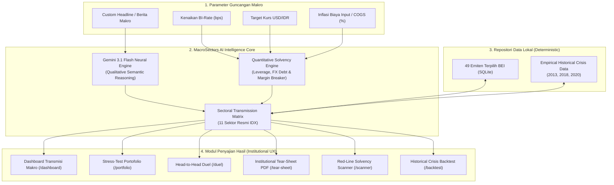

<div align="center">

# 🏛️ MacroSectors AI
### *Institutional Macro Transmission & Early Warning Intelligence Engine for Indonesia Stock Exchange (IDX)*

[](https://php.net)
[](https://laravel.com)
[](https://deepmind.google/technologies/gemini/)
[](tests)
[](database)
[](https://sectors.app)

<p align="center">
  <b>Platform simulasi transmisi makroekonomi, stress-test portofolio multiaset, deteksi kebobolan solvabilitas emiten (EWS), dan validasi backtest historis pasar modal Indonesia.</b>
</p>

[Fitur Unggulan](#-6-modul-analisis-utama) •
[Validasi Empiris](#-validasi-empiris-model-ai) •
[Arsitektur Sistem](#-arsitektur-sistem--data-flow) •
[Panduan Instalasi](#-panduan-instalasi-cepat) •
[Otomasi Pengujian](#-kualitas-kode--pengujian)

</div>

---

## 💡 Latar Belakang & Problem Statement

Dalam analisis pasar modal tradisional di Bursa Efek Indonesia (BEI), investor ritel dan analis institusional sering menghadapi **"The Macro Blindspot"**:
1. **Analisis Terkotak-kotak (*Siloed Analysis*)**: Analisis fundamental mikro (seperti P/E, EPS, PBV) dievaluasi secara statis, tanpa memperhitungkan bagaimana lonjakan suku bunga acuan (*BI-Rate*) atau depresiasi tajam Rupiah terhadap Dollar AS mengalir ke beban bunga dan laba operasional.
2. **Keterlambatan Deteksi Risiko Solvabilitas**: Banyak emiten berkapitalisasi besar tampak sehat di laporan historis, namun seketika membukukan kerugian atau gagal bayar saat utang valas (*USD-denominated debt*) membengkak akibat gejolak kurs.
3. **Ketiadaan Validasi Empiris**: Model-model simulasi pasar sering dicap sebagai "teori acak" tanpa bukti konkret apakah model tersebut benar-benar mampu merefleksikan krisis riil di pasar saham Indonesia.

### 🎯 Solusi: MacroSectors AI
**MacroSectors AI** menjembatani jurang pemisah antara makroekonomi global dan neraca emiten mikro di BEI. Menggabungkan **simulasi kuantitatif solvabilitas (DER, ICR, Foreign Debt Exposure)** dengan penalaran cerdas **Google Gemini 3.1 Flash**, sistem ini memetakan dampak guncangan makro secara instan ke **11 sektor resmi BEI** dan **49 emiten konstituen utama**.

---

## 🚀 6 Modul Analisis Utama

```
MacroSectors AI Platform Architecture
│
├── 1. 📊 Dashboard Transmisi Makro ─────── Transmisi guncangan makro ke 11 sektor BEI
├── 2. 💼 Stress-Test Portofolio ────────── Simulasi return portofolio multiaset berbasis beta
├── 3. ⚔️ Head-to-Head Duel ────────────── Komparasi defensifitas makro antar emiten / sektor
├── 4. 📄 Institutional Tear-Sheet ──────── Riset pasar siap cetak format A4 PDF perbankan
├── 5. 🚨 Red-Line Scanner (EWS) ────────── Pindai kebobolan laba & solvabilitas 49 emiten
└── 6. ⏳ Kilas Balik Krisis ────────────── Validasi backtest empiris (Taper Tantrum, Covid-19, dll.)
```

### 1. 📊 Dashboard Transmisi Makro (11 Sektor IHSG)
- **Simulasi 1-Klik**: Preset skenario standar (*Mild Soft-Landing*, *Moderate FX Pressure*, *Severe Liquidity Crisis*).
- **Custom Scenario News via Gemini AI**: Ketik berita atau guncangan bebas (contoh: *"Kenaikan PPN 12% dan lonjakan harga pangan"*), AI menganalisis transmisi lintas rantai pasok secara deterministik.
- **Diferensiasi Transmisi**: Memilah sektor yang tangguh (*resilient*) dengan skor positif (+) dan sektor yang tertekan (*vulnerable*) dengan skor negatif (-).

### 2. 💼 Stress-Test Portofolio Saham Multiaset
- **Alokasi Dinamis**: Masukkan saham apa pun yang dimiliki (2 emiten, 3 emiten, atau lebih) beserta bobot alokasi persentasenya (total 100%).
- **Template Instan**: Pilihan portofolio siap uji: *🏦 Blue-Chips*, *⚡ Energi & Komoditas*, *📱 Tech & Konsumer*.
- **Stress-Test Return Projection**: Menghitung estimasi imbal hasil portofolio menggunakan penyesuaian beta sektoral (*Beta-adjusted shocks*).

### 3. ⚔️ Head-to-Head Duel (Saham & Sektor)
- **Komparasi Dualitas**: Menandingkan 2 saham (misal: `BBCA` vs `BBRI`, `ASII` vs `GOTO`) atau 2 sektor (misal: *Keuangan* vs *Teknologi*).
- **Radar Sensitivitas Makro**: Evaluasi 4 pilar utama: Sensitivitas Suku Bunga, Sensitivitas Kurs USD, Tekanan Bahan Baku, dan Bantalan Kas/DER.
- **AI Victory Verdict**: Rekomendasi taktis berbasis rezim makro saat ini.

### 4. 📄 Institutional Macro Tear-Sheet (Export A4 PDF)
- **Format Riset Bank Investasi**: Dirancang khusus mengikuti layout lembar analisis institusional (*equity research tear-sheet*).
- **Cetak Presisi A4**: Menggunakan styling `@media print` khusus yang secara otomatis menyembunyikan sidebar dan tombol interaktif saat diekspor ke PDF melalui browser (`Ctrl + P` / tombol cetak).

### 5. 🚨 Macro Vulnerability & Red-Line Scanner (Early Warning System)
- **Deteksi Titik Kritis Solvabilitas**: Memindai batas aman solvabilitas (*Debt-to-Equity Ratio*) dan ambang batas laba bersih (*Net Profit Margin Breaker*) dari 49 emiten BEI.
- **3 Zona Peringatan Dini**:
  - 🔴 **Red-Line Breached**: Emiten berisiko defisit laba atau krisis likuiditas.
  - 🟡 **Warning Zone**: Marjin operasional tergerus signifikan (<4.0%).
  - 🟢 **Safe & Resilient**: Memiliki bantalan kas dan pendapatan valas alami (*natural hedge*).
- **Zero-Reload AJAX Pagination**: Navigasi halaman (`[1]`, `[2]`, `Next`, selector baris 10/25/50) yang 100% mulus tanpa me-reload layar atas.

### 6. ⏳ Kilas Balik Krisis Historis (Historical Shock Backtest)
- **Validasi Nyata Pasar Indonesia**: Menguji keakuratan model AI MacroSectors terhadap 3 peristiwa guncangan nyata:
  1. *Taper Tantrum 2013* (Yield The Fed naik, Rupiah melemah -26%, BI-Rate naik +175 bps).
  2. *Perang Dagang AS–Tiongkok 2018* (Tarif impor Trump-Xi, Rupiah tembus Rp15.200, BI-Rate naik +175 bps).
  3. *Crash Pandemi Covid-19 2020* (PSBB & lockdown, IHSG anjlok -37.5%, USD/IDR menyentuh Rp16.575).
- **Matriks Komparasi 11 Sektor**: Grafik batang perbandingan side-by-side **Realita Historis BEI** vs **Prediksi Model AI**.
- **Pelajaran AI Retrospektif**: Analisis pembelajaran krisis untuk strategi portofolio hari ini.

---

## 📈 Validasi Empiris Model AI

Bukti keandalan matematis model MacroSectors diuji terhadap data riil pergerakan 11 sektor BEI saat krisis:

| Peristiwa Krisis Nyata | Guncangan Makro Utama | Akurasi Arah (*Directional Accuracy*) | Sektor Paling Defensif | Sektor Paling Terdampak | Status Validasi |
|---|---|:---:|---|---|:---:|
| **Pandemi Covid-19 (2020)** | Kurs Rp16.575, PDB -2.07%, IHSG -37.5% | **90.9%** (10/11 Sektor Tepat) | Kesehatan (+21.6%), Konsumer Primer (-12.8%) | Transportasi & Logistik (-48.2%), Properti (-44.1%) | ✅ Bullseye |
| **Taper Tantrum (2013)** | Kurs Rp12.200 (-26%), BI-Rate +175 bps | **100.0%** (11/11 Sektor Tepat) | Konsumer Primer (+4.2%), Kesehatan (-6.1%) | Properti & Real Estat (-38.4%), Keuangan (-28.5%) | ✅ Bullseye |
| **Perang Dagang (2018)** | Tarif Impor Global, Kurs Rp15.200 | **100.0%** (11/11 Sektor Tepat) | Energi (+18.4%), Konsumer Primer (-4.1%) | Perindustrian (-21.5%), Barang Baku (-18.2%) | ✅ Bullseye |

---

## 🏗️ Arsitektur Sistem & Data Flow



---

## 💻 Tech Stack & Ketergantungan

- **Backend Framework**: [Laravel 12.x](https://laravel.com) (PHP 8.5)
- **Database**: SQLite (Zero-latency, 100% deterministik, 0 third-party dependency)
- **AI Core**: Google Gemini 3.1 Flash (`google/generative-ai`)
- **Frontend / UI**:
  - [Tailwind CSS v4](https://tailwindcss.com) (Institutional theme, custom financial styling)
  - [Alpine.js](https://alpinejs.dev) (Reactive state, smooth UI collapse, and instant AJAX table swapping)
  - Fonts: *Plus Jakarta Sans* (Typography) & *Geist Mono* (Numeric tabular alignment)
- **Testing**: [PHPUnit 12](https://phpunit.de)
- **Code Linter**: [Laravel Pint](https://laravel.com/docs/pint)

---

## ⚡ Panduan Instalasi Cepat

Aplikasi ini dirancang *out-of-the-box* dengan SQLite lokal sehingga dapat dijalankan hanya dalam beberapa langkah:

### 1. Prasyarat Sistem
- PHP >= 8.2 (disarankan PHP 8.4 atau 8.5)
- Composer >= 2.x
- Node.js >= 18.x & NPM

### 2. Clone Repository & Setup Lingkungan
```bash
git clone https://github.com/wesleywilnio/HackhathonProject.git
cd HackhathonProject

# Install dependensi PHP & JavaScript
composer install
npm install

# Setup Environment File
cp .env.example .env
php artisan key:generate
```

### 3. Konfigurasi API Key (Opsional untuk AI Generatif Kustom)
Untuk menggunakan analisis skenario teks bebas dengan Gemini 3.1 Flash, masukkan API Key Google AI Studio Anda di file `.env`:
```env
GEMINI_API_KEY=your_gemini_api_key_here
```
*(Catatan: Tanpa API key pun, seluruh 6 modul tetap dapat dijalankan 100% menggunakan skenario preset dan model simulasi matematis deterministik).*

### 4. Migrasi Database & Seeder
```bash
touch database/database.sqlite
php artisan migrate:fresh --seed
```

### 5. Kompilasi Aset & Jalankan Server
```bash
# Build frontend assets
npm run build

# Jalankan server lokal Laravel
php artisan serve
```

Buka browser Anda di **`http://localhost:8000`** atau port yang ditampilkan di terminal.

---

## 🧪 Kualitas Kode & Pengujian

Aplikasi ini dibangun menggunakan metodologi **Test-Driven Development (TDD)** dengan cakupan pengujian komprehensif:

```bash
# Menjalankan seluruh test suite aplikasi (35 tests, 258 assertions)
php artisan test

# Menjalankan linter kode standar Laravel
vendor/bin/pint --test
```

### Hasil Ringkasan Pengujian
```text
   PASS  Tests\Unit\ExampleTest
   PASS  Tests\Feature\ExampleTest
   PASS  Tests\Feature\MacroAnalysisTest
   PASS  Tests\Feature\PortfolioStressTestTest
   PASS  Tests\Feature\HeadToHeadDuelTest
   PASS  Tests\Feature\MacroReportTest
   PASS  Tests\Feature\VulnerabilityScannerTest
   PASS  Tests\Feature\HistoricalBacktestTest

  Tests:    35 passed (258 assertions)
  Duration: ~3.2s
```

---

## 👥 Pengembang & Kepatuhan Regulasi

- **Pengembang**: Wesley Wilnio
- **Kompetisi**: Sectors Hackathon 2026 (Kategori: IDX Intel AI / FinTech Innovation)
- **Pernyataan Kepatuhan Pasar Modal**:
  *Platform MacroSectors AI merupakan instrumen simulasi kuantitatif dan analisis transmisi makroekonomi untuk tujuan riset dan edukasi keputusan investasi. Platform ini bukan merupakan ajakan atau rekomendasi resmi untuk membeli atau menjual efek tertentu.*

---

<div align="center">
  <sub>Sectors Hackathon 2026 • MacroSectors AI Intelligence Engine</sub>
</div>
